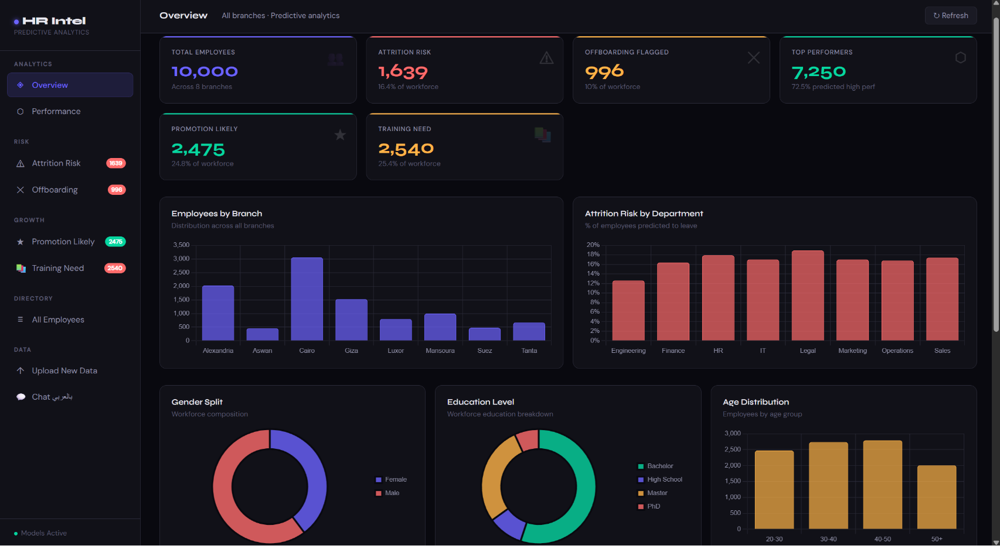

# HR Intelligence Project



A Flask-based HR analytics dashboard that predicts employee attrition, performance, offboarding risk, promotion readiness, and training needs using machine learning models.

## Features

- Interactive HR dashboard with KPI cards and charts
- Attrition risk analysis and employee insights
- Offboarding and performance prediction views
- Promotion readiness and training-need modules
- Excel/CSV upload support for new employee data
- Pretrained models included for immediate use

## Project Structure

- app.py - Flask application and API routes
- train_models.py - training pipeline for the ML models
- templates/ - HTML dashboard templates
- static/ - CSS and JavaScript assets
- models/ - trained models, encoders, and prediction outputs

## Requirements

Python 3.9+

Install dependencies:

```bash
pip install -r requirements.txt
```

## Run the Application

```bash
python app.py
```

Then open:

```text
http://localhost:5050
```

## Train Models Again

If you want to retrain the models from the dataset:

```bash
python train_models.py
```

## Notes

- The dashboard uses pretrained models already stored in the models folder.
- The upload feature allows you to score new employee data with the same model pipeline.
- The app is designed for demo and internal analytics use.

## Author

Ammar Amgad
